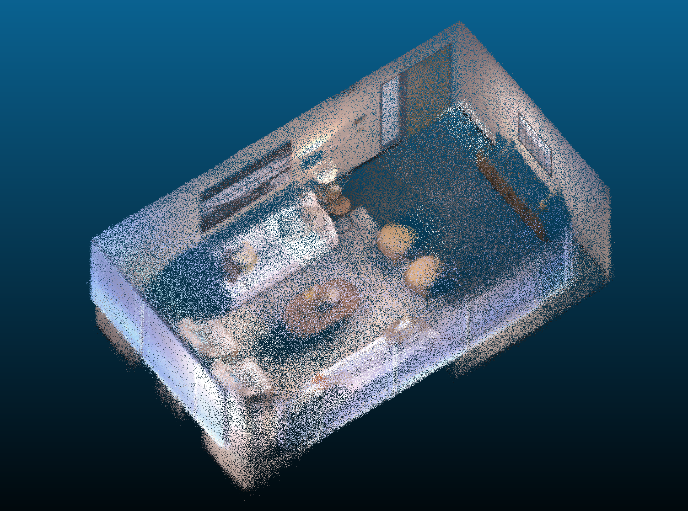
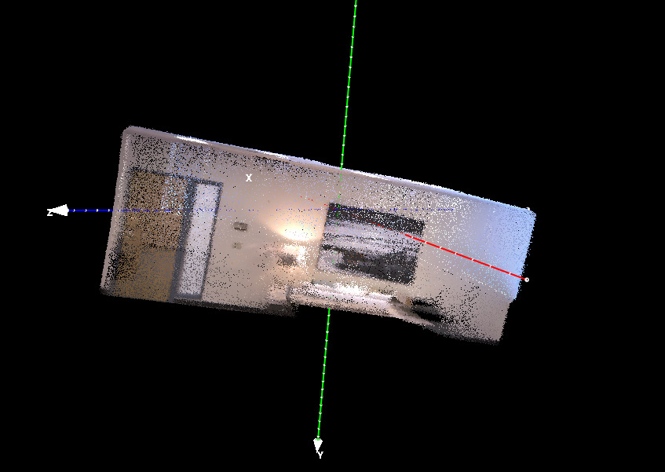
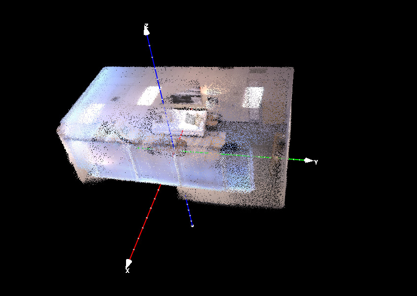
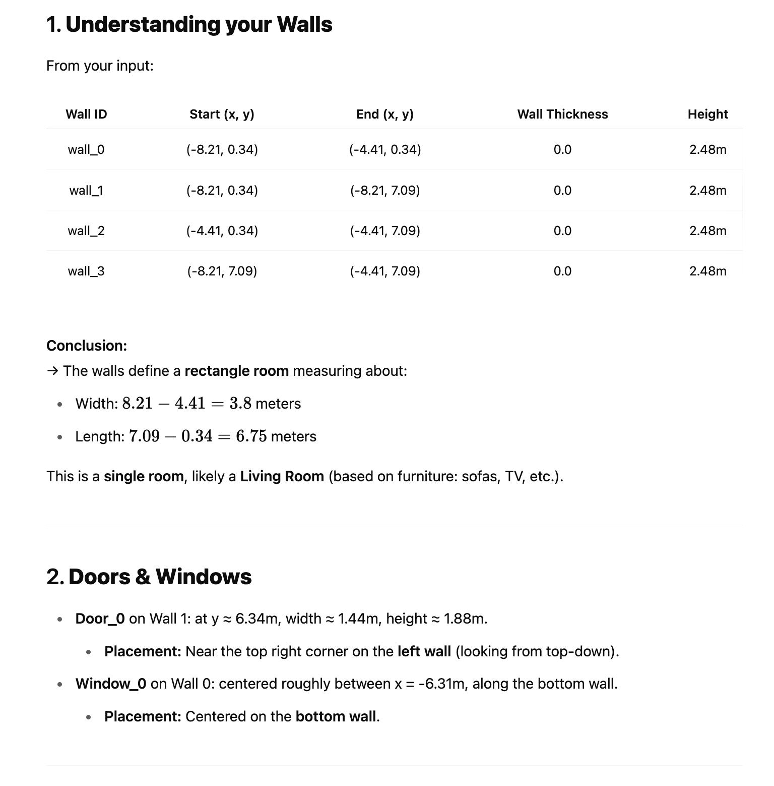
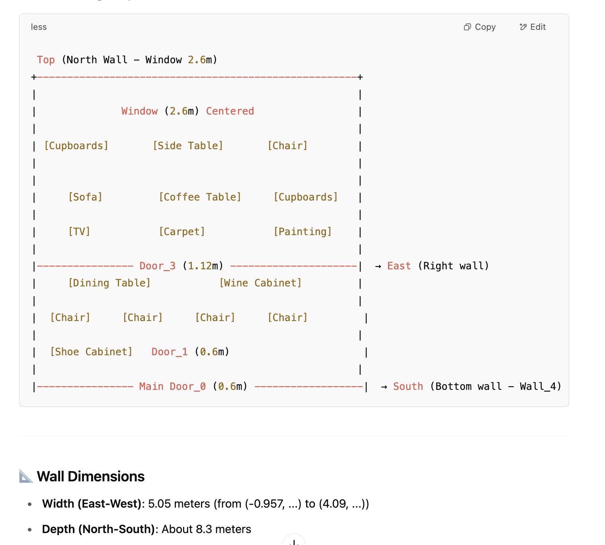
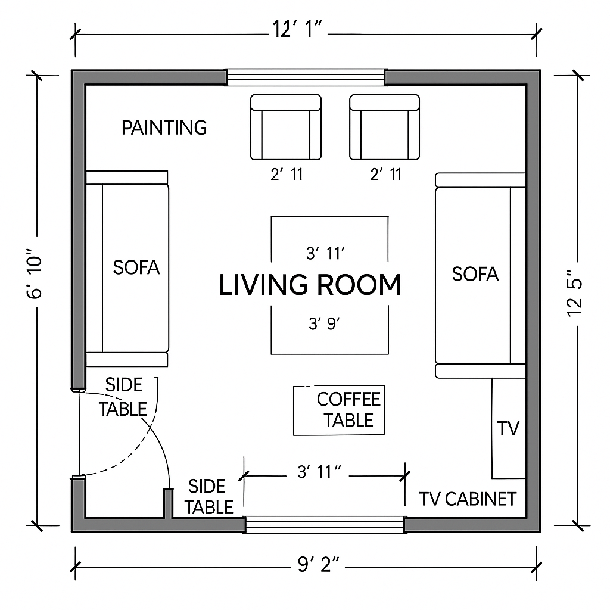
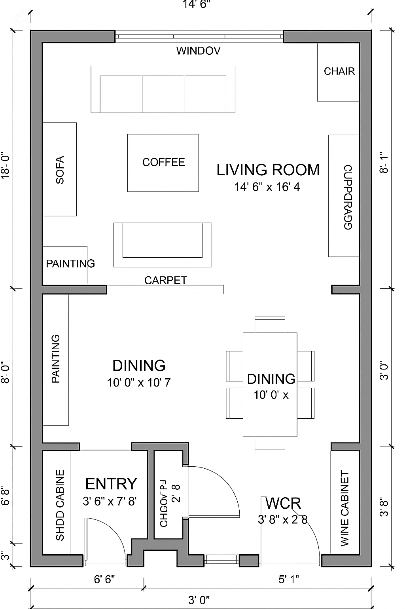

# Future Extension Demo: Integrating SpatialLM for Layout Estimation from Video


## Why Future Extension Not Current Solution?

Several technical hurdles currently limit the integration of this enhanced use case into our Azure cloud deployment for the Microsoft AI Hackathon. First, there are deployment challenges related to packaging and orchestrating resource-intensive components, such as `spatialLM` requires a Linux-based runtime with CUDA support - posing compatibility and hardware constraints within Azure environments. 

Additionally, the `SLAM3R` 3D point cloud reconstruction model, requires extensive domain knowledge to tune model parameters appropriately for varying video inputs (e.g., differing frame rates, camera angles, resolutions, and degree of overlap between frames). This complexity not only increases implementation overhead but also reduces robustness, especially when dealing with non-sequential image frames where SLAM3R currently performs suboptimally. 


## Summary

This demo showcases a future extension to our pipeline by integrating Spatial Language Models (SpatialLM) — a recently released, state-of-the-art model for house layout estimation. Our goal is to enable smarter, more context-aware spatial reasoning and to support video-based input, making the workflow more accessible and flexible. 

Key enhancements enabled by this integration:

- **Smarter Spatial Understanding**: Improved interpretation of spatial configurations and relationships within indoor environments.

- **Context-Aware Floor Plan Generation**: Generation of floor plans that reflect both spatial structure and contextual cues from the scene.

- **Advanced Spatial Reasoning Features**: Capabilities such as intelligent layout suggestions and spatial query interpretation.

- **Video Input Support**: Accepting video recordings as input, allowing users to walk through a space rather than manually provide images.

## Demo Overview

We demonstrate an end-to-end workflow for generating floor plans and estimating room layouts from a video input, using two examples: a single-room and a multi-room house unit.

The workflow includes the following five main steps:

1) **Point Cloud Reconstruction**: Use `SLAM3R` model to reconstruct a 3D point cloud from the input video.

2) **Orientation Alignment**: Align the reconstructed point cloud with the standard ScanNet coordinate convention.

3) **Metric Scaling**: Normalize the point cloud to achieve an approximately metric-accurate scale.

4) **Layout Estimation**: Run the `SpatialLM` model to estimate the room layout and object placements.

5) **Visual Floor Plan Generation**: Use the estimated spatial information as input to a text-to-image model (e.g., `Gpt-image-1`) to generate visual representations of the layout.

## Video Demo

Link: https://youtu.be/zhSWZRst6LU

## 1. Reconstruct a point cloud with SLAM3R

A newly released open-source SLAM system [SLAM3R](https://github.com/PKU-VCL-3DV/SLAM3R) offers impressive capabilities for reconstructing 3D point clouds from RGB video. In our workflow, these point clouds serve as input for downstream layout estimation.

To set up SLAM3R, follow the [installation instructions](https://github.com/PKU-VCL-3DV/SLAM3R?tab=readme-ov-file#installation). After installation, we used the [Replica dataset demo](https://github.com/PKU-VCL-3DV/SLAM3R?tab=readme-ov-file#replica-dataset) to generate the reconstructed `.ply` file for a single-room example, which we use in the next steps of our pipeline.

Example of reconstructed point cloud of the single-room layout:

<div style="text-align: center;">
  
</div>

## 2. Align the output point cloud

This is a crucial step in making sure the user input is conformed to what the inference model `SpatialLM` was trained for, whereby input point clouds are considered axis-aligned where the z-axis is the up axis. The input point clouds should follow the `ScanNet` scenes orientation convension, which is "_Transforms scans to z-up alignment for scans and tries to align walls to x-y planes._" in [Alignment](https://github.com/ScanNet/ScanNet/tree/master/Alignment). 

For demo purpose, we this manually with a tool called `CloudCompare`. You can find that after alignment, the house faces up on the z axis and the walls are aligned perpenticulary to the x and y axes.

|                     Before Alignment                     |                    After Alignment                    |
| :------------------------------------------------------: | :---------------------------------------------------: |
|  |  |


For future implementation, the realignment can be automated using tools like [VanishingPoint Estimation](https://github.com/yanconglin/VanishingPoint_HoughTransform_GaussianSphere), [Manhattan Frame Estimation from video](https://github.com/jstraub/rtmf), Manhattan Frame Estimation from surface normals (ref paper: Globally Optimal Manhattan Frame Estimation in Real-time, Manhattan World Inference in the Space of Surface Normals) for estimating the Manhattan Frame from image, video or point cloud. And more recent methods such as [U-ARE-ME](https://github.com/callum-rhodes/U-ARE-ME), [Perspective Fields for Single Image Camera Calibration](https://github.com/jinlinyi/PerspectiveFields). 

## 3. Ensure the scale of the point cloud

The `SpatialLM` model is trained on point clouds with a metric accurate scale. The value 1 refer to 1 meter in the real world. The scale of the point cloud outputs can vary from different SLAM systems, hence it is important to align this to the correct scale.

Since it is indoor scene, we made an assumption on a rough estimation of the scale of the scene by the height of the walls, i.e. resize the aligned point cloud to have a height of 2.5 meters.

```python
import open3d as o3d
from spatiallm.pcd import load_o3d_pcd, get_points_and_colors

point_cloud = load_o3d_pcd(point_cloud_file)
points, colors = get_points_and_colors(point_cloud)
min_z = np.min(points[:, 2])
max_z = np.max(points[:, 2])
height = max_z - min_z
estimated_height = 2.5
scale = estimated_height / height
points = points * scale

# export the point cloud
point_cloud = o3d.geometry.PointCloud()
point_cloud.points = o3d.utility.Vector3dVector(points)
point_cloud.colors = o3d.utility.Vector3dVector(colors.astype(np.float32)/ 255.0)
o3d.io.write_point_cloud(f"scaled_point_cloud.ply", point_cloud)
```

There are many other more creative approaches to estimate the scale of the point cloud. For example, [Depth Pro](https://github.com/apple/ml-depth-pro) for estimating keyframe depth maps and comparing them with keyframe point clouds generated by the reconstruction models.


## 4. Run the inference

The installation for SpatialLM can be found [here](https://github.com/manycore-research/SpatialLM?tab=readme-ov-file#installation).

Once the point clouds are scaled and reoriented, we then used it to run the layout estimation:

```bash
python inference.py --point_cloud scaled_point_cloud.ply --output replica_layout.txt --model_path manycore-research/SpatialLM-Llama-1B
# visualize the layout
python visualize.py --point_cloud scaled_point_cloud.ply --layout replica_layout.txt --save replica_layout.rrd
rerun replica_layout.rrd
```
|                     Single Room - View 1                      |                   Single Room -   View 2                      |
| :----------------------------------------------: | :----------------------------------------------: |
|  |  |


|                      Multi Room - View 1                      |                      Multi Room - View 2                      |
| :----------------------------------------------: | :----------------------------------------------: |
|  |  |

Note: there can be false negatives that are missed out being detected due to the fact that the model was trained on chinese apartments and may not be able to generalize very well to more diverse scenarios, such as non-standard layouts, cluttered spaces, or outdoor environments.

The output `replica_layout.txt` for the single-room example is shown as follows which contain the detected objects in the room including each wall, door and other furniture pieces with their respective dimensions. This is later on used as input to the `{room_objects_specifications}` placeholder in the LLM prompt later on.

```
wall_0=Wall(-8.207611340931601,0.34383346554858873,4.845816320890159,-4.407611340931602,0.34383346554858873,4.845816320890159,2.4800000000000004,0.0)
wall_1=Wall(-8.207611340931601,0.34383346554858873,4.845816320890159,-8.207611340931601,7.093833465548588,4.845816320890159,2.4800000000000004,0.0)
wall_2=Wall(-4.407611340931602,0.34383346554858873,4.845816320890159,-4.407611340931602,7.093833465548588,4.845816320890159,2.4800000000000004,0.0)
wall_3=Wall(-8.207611340931601,7.093833465548588,4.845816320890159,-4.407611340931602,7.093833465548588,4.845816320890159,2.4800000000000004,0.0)
door_0=Door(wall_1,-8.207611340931601,6.343833465548588,5.795816320890159,1.4400000000000002,1.8800000000000001)
window_0=Window(wall_0,-6.307611340931602,0.34383346554858873,6.395816320890159,2.8000000000000003,1.4800000000000002)
bbox_0=Bbox(sofa,-4.957611340931602,3.1938334655485887,5.245816320890159,-1.5708000000000002,2.0625,1.03125,0.8125)
bbox_1=Bbox(sofa,-7.657611340931602,3.1938334655485887,5.245816320890159,-1.5708000000000002,2.0625,1.03125,0.8125)
bbox_2=Bbox(sofa,-5.907611340931602,4.893833465548588,5.045816320890159,-3.1416,0.625,0.625,0.4375)
bbox_3=Bbox(sofa,-6.757611340931602,4.843833465548588,5.045816320890159,-3.1416,0.625,0.625,0.4375)
bbox_4=Bbox(coffee_table,-6.307611340931602,3.143833465548589,5.295816320890159,-1.5708000000000002,1.1875,0.84375,0.9375)
bbox_5=Bbox(side_table,-7.757611340931602,4.343833465548588,5.4458163208901595,-3.1416,0.5625,0.5625,1.21875)
bbox_6=Bbox(side_table,-4.807611340931602,1.9438334655485887,5.4458163208901595,-3.1416,0.5625,0.5625,1.21875)
bbox_7=Bbox(tv,-4.407611340931602,3.243833465548589,6.095816320890159,-1.5708000000000002,1.5625,0.03125,0.90625)
bbox_8=Bbox(tv_cabinet,-4.657611340931602,3.1938334655485887,5.395816320890159,-1.5708000000000002,2.28125,0.46875,1.0625)
bbox_9=Bbox(painting,-8.157611340931602,3.1938334655485887,6.245816320890159,-1.5708000000000002,1.65625,0.03125,1.09375)
bbox_10=Bbox(carpet,-6.307611340931602,3.1938334655485887,4.845816320890159,-1.5708000000000002,3.34375,2.375,0.0)
```

## 5. Floor Plan Generation with Large Language Models (LLM)

To demonstrate the potential of generative AI in spatial layout synthesis, we employed the latest text-to-image model, gpt-image-1, to generate 2D floor plans using the inferred measurement outputs from the previous step.

We used a simple prompt template, where `{room_objects_specifications}` represents the extracted measurements and object descriptions:

```
You are a professional architectural draftsperson specializing in detailed 2D floor plan drawings. Your task is to generate a clear, practical, and construction-ready floor plan based on the following specifications:

{room_objects_specifications}


# Plan Element Interpretation

Refer to the following measurement formats for each object type:
- Wall: (ax, ay, az, bx, by, bz, height, thickness)
- Door: (wall_id, position_x, position_y, position_z, width, height)
- Window: (wall_id, position_x, position_y, position_z, width, height)
- Bbox (generic object): (class, position_x, position_y, position_z, angle_z, scale_x, scale_y, scale_z)


# Output Requirements

- The output must be a top-down 2D floor plan.
- Label all rooms clearly (e.g.  Kitchen, Living Room, Bedroom)
- Include dimensions for walls, doors, windows, and major fixed objects
- Use universally recognized symbols: and abbreviations
    - Example 1: Rectangle with double lines to represent wardrobes with doors
    - Example 2: A square with the label 'WM' to represent washing machine.
- Ensure the plan is clean, legible, and interpretable by all professionals involved in construction, design and procurement.


# Practicality Check

Verify room connections and overall flow, and adjust any conflicting measurements to ensure realistic architectural feasibility.
```

### Finding: LLM Enhanced Spatial Understanding

The images below show the first responses returned by the LLM. These outputs highlight the model’s capacity to interpret structural relationships, spatial dimensions, and object proportions from textual descriptions - producing a plausible draft of the room layout.

|                               |              |
| :----------------------------------------------: | :----------------------------------------------: |
|  |  |


### Floor Plans Outputs


|                        Single Room       |        Multi Room      |
| :----------------------------------------------: | :----------------------------------------------: |
|  |  |

### Reflections

While promising, these generated floor plans can still contain hallucinations and are not always accurate representations of the true layout. However, performance can be improved with iterative prompt engineering. For example, preprocessing the spatialLM outputs to round decimal values and annotate dimensions with positional context (e.g., “Width: 3.2m”) may help guide the model more effectively. Additionally, providing the 3D bounding box structure layout from the spatialLM visualisation alongside the textual input could further enhance spatial understanding.

Despite limitations, the generated plans follow common design conventions, such as dimension labeling and furniture abbreviations, demonstrating the potential of LLMs in early-stage spatial design assistance.
